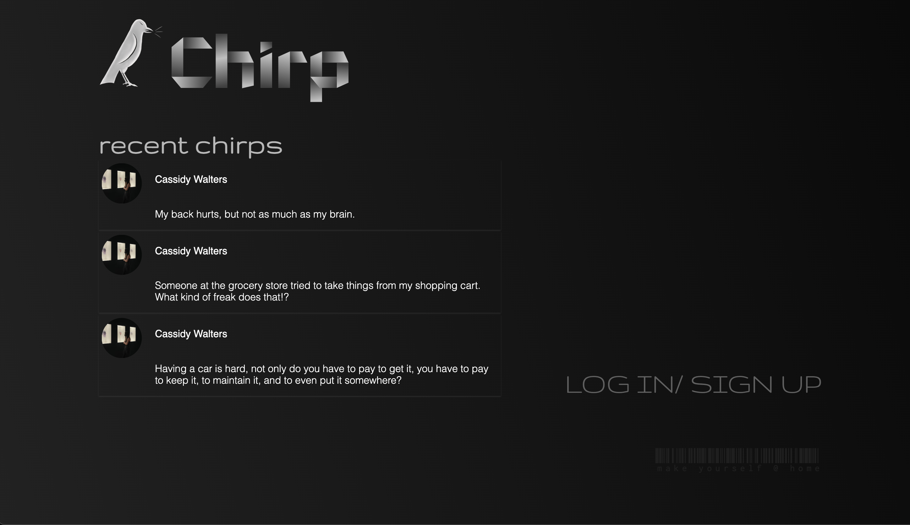
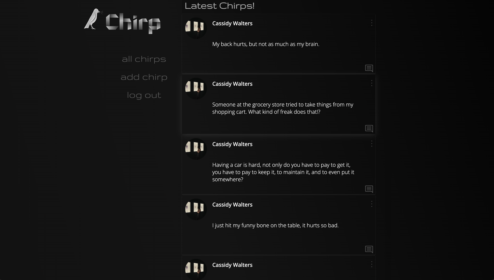
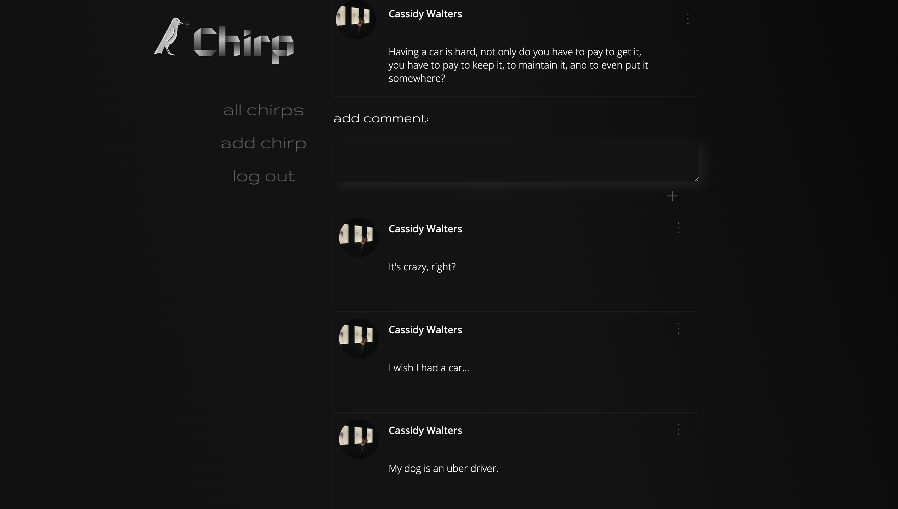

# Chirp

>Chirp is the ultimate platform for letting off steam and getting your frustrations out. Tired of the filtered, picture-perfect world of social media? Look no further, because Chirp is here to provide a safe space for people to vent, complain, and be vulnerable without judgment. Life isn't always rainbows and sunshine, we believe that it's essential to acknowledge and express our frustrations, disappointments, and grievances. This platform is designed exclusively for that purpose - a place where you can let your guard down and be your authentic, unfiltered self.

### Get Started!
>Link:[Source](https://chirpcw.herokuapp.com/)

### Preview

#### Landing Page:

#### View of all posts:

#### View a of single post and it's commments:

#### View of adding a post:

>To ensure the integrity of the platform, Chirp utilizes the [Twinword Emotion Analysis API](https://www.twinword.com/api/emotion-analysis.php) to filter out happy posts and encourages users to delve deeper into their frustrations.

By excluding happy posts, Chirp can create a space that focuses on the raw and often unspoken aspects of human experiences. This approach encourages users to be introspective, acknowledge their frustrations, and find solace in shared struggles.

### Technologies Used:
- JavaScript
- CSS
- Mongo DB
- Express
- Node.js
- [Twinword Emotion Analysis API](https://www.twinword.com/api/emotion-analysis.php)

### Next Steps:
- Fix post/comment edit pop-up to appear in a more elegant way.
- Separate JavaScript used in .ejs files into its own Javascript file so that code is less repetitive.
- Refactor CSS files to make styling more modular and consistent. 
- Add functionality for users to have their own profile pages.
- Add functionality for users to choose their own usernames and profile photos.
- Add functionality for users to like each other's posts.
- Create an alternate 'light mode' for users to choose instead of th default dark theme.